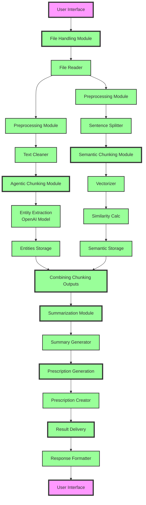

```mermaid
graph TD;
    A[User Interface] --> B[File Handling Module]
    B --> C[File Reader]
    C --> D[Preprocessing Module]
    C --> E[Preprocessing Module]
    D --> F[Text Cleaner]
    E --> G[Sentence Splitter]
    F --> H[Agentic Chunking Module]
    G --> I[Semantic Chunking Module]
    H --> J[Entity Extraction<br>OpenAI Model]
    I --> K[Vectorizer]
    K --> L[Similarity Calc]
    J --> M[Entities Storage]
    L --> N[Semantic Storage]
    M --> O[Combining Chunking Outputs]
    N --> O[Combining Chunking Outputs]
    O --> P[Summarization Module]
    P --> Q[Summary Generator]
    Q --> R[Prescription Generation]
    R --> S[Prescription Creator]
    S --> T[Result Delivery]
    T --> U[Response Formatter]
    U --> V[User Interface]

    style A fill:#f9f,stroke:#333,stroke-width:4px
    style B fill:#9f9,stroke:#333,stroke-width:4px
    style C fill:#9f9,stroke:#333,stroke-width:2px
    style D fill:#9f9,stroke:#333,stroke-width:2px
    style E fill:#9f9,stroke:#333,stroke-width:2px
    style F fill:#9f9,stroke:#333,stroke-width:2px
    style G fill:#9f9,stroke:#333,stroke-width:2px
    style H fill:#9f9,stroke:#333,stroke-width:4px
    style I fill:#9f9,stroke:#333,stroke-width:4px
    style J fill:#9f9,stroke:#333,stroke-width:2px
    style K fill:#9f9,stroke:#333,stroke-width:2px
    style L fill:#9f9,stroke:#333,stroke-width:2px
    style M fill:#9f9,stroke:#333,stroke-width:2px
    style N fill:#9f9,stroke:#333,stroke-width:2px
    style O fill:#9f9,stroke:#333,stroke-width:4px
    style P fill:#9f9,stroke:#333,stroke-width:4px
    style Q fill:#9f9,stroke:#333,stroke-width:2px
    style R fill:#9f9,stroke:#333,stroke-width:4px
    style S fill:#9f9,stroke:#333,stroke-width:2px
    style T fill:#9f9,stroke:#333,stroke-width:4px
    style U fill:#9f9,stroke:#333,stroke-width:2px
    style V fill:#f9f,stroke:#333,stroke-width:4px
```
